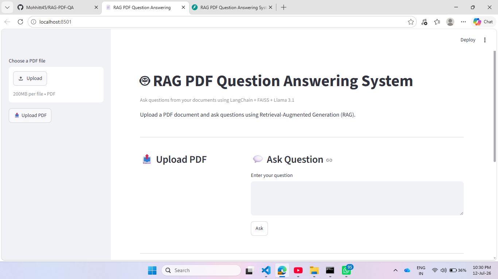
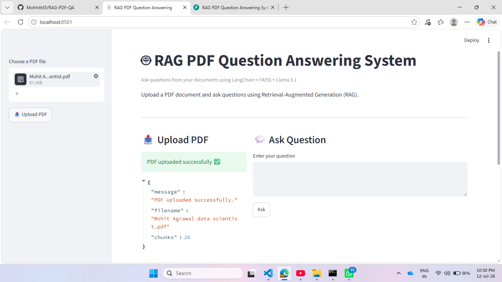
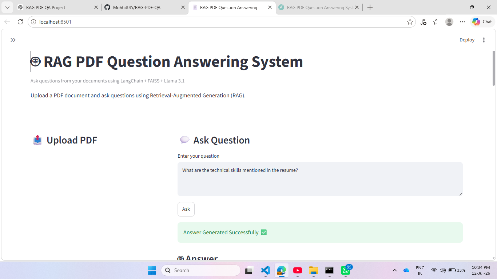
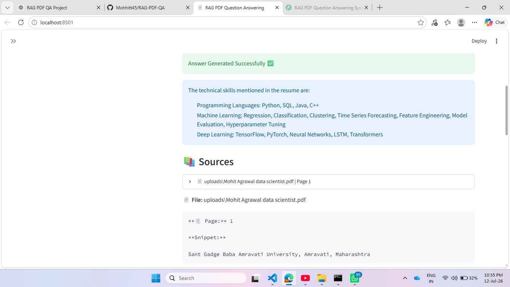

# 📄 Retrieval-Augmented Generation (RAG) based PDF Question Answering System


> **Note:** This project is intended for local execution. A complete local demo (FastAPI + Streamlit) is provided. Cloud deployment was evaluated but limited by free-tier infrastructure constraints.

An end-to-end Retrieval-Augmented Generation (RAG) application that enables users to upload PDF documents and ask natural language questions. The system retrieves the most relevant document chunks using semantic search with FAISS and generates grounded answers using Hugging Face hosted Large Language Models (LLMs).

---

## 🚀 Features

- 📄 Upload PDF documents through FastAPI
- ✂️ Automatic document chunking using Recursive Character Text Splitter
- 🧠 Semantic embeddings using HuggingFace Sentence Transformers
- 🔍 FAISS Vector Database for efficient similarity search
- 🤖 Answer generation using Hugging Face LLM
- 💬 Retrieval-Augmented Generation (RAG) pipeline
- 📚 Source citation with PDF filename and page number
- 📑 Incremental indexing for multiple PDF documents
- ⚙️ Centralized configuration using `config.py`
- 🌐 REST API built with FastAPI
- 🐳 Docker support

---

# 🏗️ Architecture

```
                 User
                   │
                   ▼
            Upload PDF (/upload)
                   │
                   ▼
             PyPDFLoader
                   │
                   ▼
      Recursive Character Splitter
                   │
                   ▼
    HuggingFace Embeddings (MiniLM)
                   │
                   ▼
          FAISS Vector Database
                   │
                   ▼
            User Question (/ask)
                   │
                   ▼
          Similarity Search (Top-K)
                   │
                   ▼
          Prompt Engineering
                   │
                   ▼
        Hugging Face LLM
                   │
                   ▼
      Answer + Source Citations
```

---

# 🛠️ Tech Stack

| Category | Technologies |
|----------|--------------|
| Language | Python |
| Framework | FastAPI |
| LLM | Hugging Face Inference API |
| AI Framework | LangChain |
| Embeddings | HuggingFace Sentence Transformers |
| Vector Database | FAISS |
| PDF Processing | PyPDFLoader |
| API Testing | Swagger UI |
| Containerization | Docker |

---

# 📂 Project Structure

```
RAG-PDF-QA
│
├── app
│   ├── config.py
│   ├── create_vectorstore.py
│   ├── ingest.py
│   ├── main.py
│   ├── rag.py
│   └── upload.py
│
├── uploads
├── vectorstore
├── data
│
├── Dockerfile
├── .dockerignore
├── requirements.txt
└── README.md
```

---

# ⚙️ Installation

## Clone Repository

```bash
git clone https://github.com/Mohhitt45/RAG-PDF-QA.git

cd RAG-PDF-QA
```

---

## Create Virtual Environment

Windows

```bash
py -m venv venv
```

Activate

```bash
venv\Scripts\activate
```

---

## Install Dependencies

```bash
pip install -r requirements.txt
```

---

# 🐳 Docker

Build Docker Image

```bash
docker build -t rag-pdf-qa .
```

Run Container

```bash
docker run -p 8000:8000 rag-pdf-qa
```

---

# 📌 API Endpoints

## GET /

Health Check

Response

```json
{
    "message":"RAG PDF QA API Running 🚀"
}
```

---

## POST /upload

Uploads a PDF document and automatically creates or updates the FAISS vector database.

Example Response

```json
{
    "message":"PDF uploaded successfully.",
    "filename":"resume.pdf",
    "chunks":42
}
```

---

## POST /ask

Ask questions from uploaded documents.

Request

```json
{
    "question":"What are the technical skills?"
}
```

Example Response

```json
{
    "question":"What are the technical skills?",
    "response":{
        "answer":"The document mentions Python, SQL, FastAPI, LangChain and Machine Learning.",
        "sources":[
            {
                "file":"resume.pdf",
                "page":1,
                "content":"Python, SQL, FastAPI..."
            }
        ]
    }
}
```

---

# 🔄 Workflow

```
Upload PDF

↓

Extract Text

↓

Split into Chunks

↓

Generate Embeddings

↓

Store in FAISS

↓

Ask Question

↓

Retrieve Relevant Chunks

↓

Generate Answer using Hugging Face LLM

↓

Return Answer + Source Citation
```

---

# 🌟 Key Highlights

- Retrieval-Augmented Generation (RAG)
- Semantic Search using FAISS
- Local LLM (No OpenAI API Required)
- Source Grounded Responses
- Multi-PDF Incremental Indexing
- Dockerized Deployment
- Production-ready FastAPI Backend

---

---

# 📸 Application Demo

### 1. Streamlit User Interface

The application provides an interactive interface for uploading PDF documents and asking questions.




### 2. PDF Upload & Processing

Users can upload PDF files. The system processes documents, creates embeddings, and stores them in FAISS vector database.




### 3. Document Question Answering

Users can ask natural language questions related to uploaded documents.




### 4. AI Generated Answer with Sources

The RAG pipeline retrieves relevant document chunks and generates grounded answers with source references.



---

# 🚀 Future Enhancements

- Web-based Chat Interface
- Conversation Memory
- Hybrid Search (BM25 + Vector Search)
- Authentication & User Management
- Streaming Responses
- Cloud Deployment (using scalable GPU-enabled infrastructure)
- Support for DOCX, TXT and CSV documents
- Reranking for improved retrieval accuracy

---

## 🚀 How to Run Locally


### 1. Create a `.env` File

```env
HF_TOKEN=your_huggingface_token
```

### 2. Start the FastAPI Backend

```bash
uvicorn app.main:app --reload
```

Backend will run at:

```
http://127.0.0.1:8000
```

### 3. Start the Streamlit Frontend

Open another terminal and run:

```bash
streamlit run frontend.py
```

Frontend will run at:

```
http://localhost:8501
```

### 4. Upload a PDF

- Upload any PDF document.
- Wait for indexing to complete.
- Ask questions related to the uploaded document.
- The system retrieves relevant content using FAISS and generates answers using a Hugging Face LLM.

## 📝 Note

This project is designed to run locally.

The application was successfully tested using a local FastAPI backend and Streamlit frontend. Cloud deployment was evaluated, but free-tier hosting platforms encountered memory limitations for the AI stack used in this project.

# 👨‍💻 Author

**Mohit Agrawal**

Data Scientist | AI Engineer | Machine Learning | Generative AI | RAG | LangChain | FastAPI | Python

---

# ⭐ If you found this project useful, consider giving it a Star!