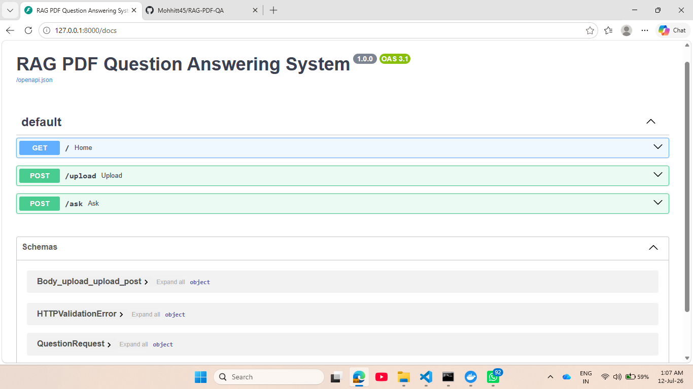
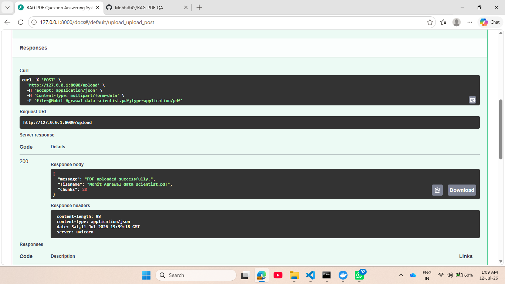
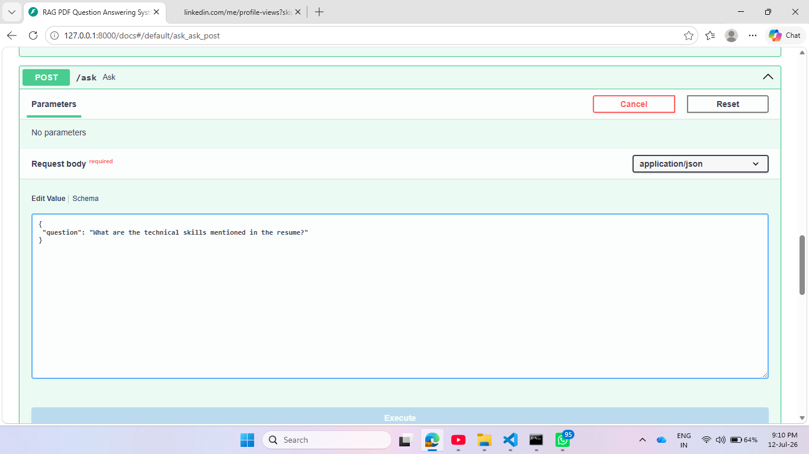
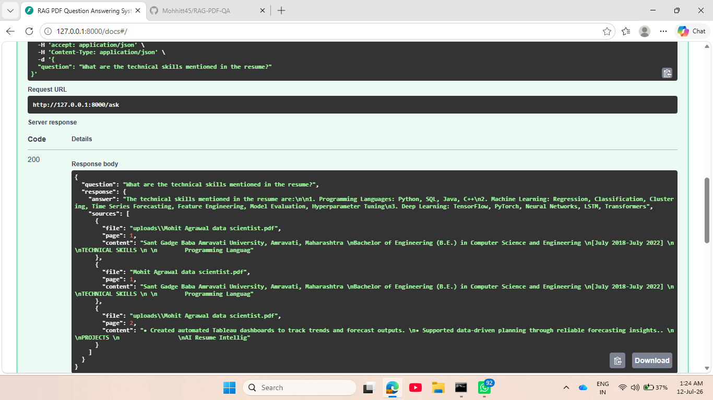

# 📄 Retrieval-Augmented Generation (RAG) based PDF Question Answering System


An end-to-end Retrieval-Augmented Generation (RAG) application that enables users to upload PDF documents and ask natural language questions. The system retrieves the most relevant document chunks using semantic search with FAISS and generates grounded answers using a locally hosted Llama 3.1 model via Ollama.

---

## 🚀 Features

- 📄 Upload PDF documents through FastAPI
- ✂️ Automatic document chunking using Recursive Character Text Splitter
- 🧠 Semantic embeddings using HuggingFace Sentence Transformers
- 🔍 FAISS Vector Database for efficient similarity search
- 🤖 Local LLM inference using Ollama (Llama 3.1)
- 💬 Retrieval-Augmented Generation (RAG) pipeline
- 📚 Source citation with PDF filename and page number
- 📑 Incremental indexing for multiple PDF documents
- ⚙️ Centralized configuration using `config.py`
- 🌐 REST API built with FastAPI
- 🐳 Docker support

---

# 🏗️ Architecture

```
                 User
                   │
                   ▼
            Upload PDF (/upload)
                   │
                   ▼
             PyPDFLoader
                   │
                   ▼
      Recursive Character Splitter
                   │
                   ▼
    HuggingFace Embeddings (MiniLM)
                   │
                   ▼
          FAISS Vector Database
                   │
                   ▼
            User Question (/ask)
                   │
                   ▼
          Similarity Search (Top-K)
                   │
                   ▼
          Prompt Engineering
                   │
                   ▼
        Ollama (Llama 3.1)
                   │
                   ▼
      Answer + Source Citations
```

---

# 🛠️ Tech Stack

| Category | Technologies |
|----------|--------------|
| Language | Python |
| Framework | FastAPI |
| LLM | Ollama (Llama 3.1) |
| AI Framework | LangChain |
| Embeddings | HuggingFace Sentence Transformers |
| Vector Database | FAISS |
| PDF Processing | PyPDFLoader |
| API Testing | Swagger UI |
| Containerization | Docker |

---

# 📂 Project Structure

```
RAG-PDF-QA
│
├── app
│   ├── config.py
│   ├── create_vectorstore.py
│   ├── ingest.py
│   ├── main.py
│   ├── rag.py
│   └── upload.py
│
├── uploads
├── vectorstore
├── data
│
├── Dockerfile
├── .dockerignore
├── requirements.txt
└── README.md
```

---

# ⚙️ Installation

## Clone Repository

```bash
git clone https://github.com/yourusername/RAG-PDF-QA.git

cd RAG-PDF-QA
```

---

## Create Virtual Environment

Windows

```bash
py -m venv venv
```

Activate

```bash
venv\Scripts\activate
```

---

## Install Dependencies

```bash
pip install -r requirements.txt
```

---

## Start Ollama

```bash
ollama serve
```

Pull model (first time only)

```bash
ollama pull llama3.1
```

---

## Run FastAPI

```bash
uvicorn app.main:app --reload
```

Open

```
http://127.0.0.1:8000/docs
```

---

# 🐳 Docker

Build Docker Image

```bash
docker build -t rag-pdf-qa .
```

Run Container

```bash
docker run -p 8000:8000 rag-pdf-qa
```

---

# 📌 API Endpoints

## GET /

Health Check

Response

```json
{
    "message":"RAG PDF QA API Running 🚀"
}
```

---

## POST /upload

Uploads a PDF document and automatically creates or updates the FAISS vector database.

Example Response

```json
{
    "message":"PDF uploaded successfully.",
    "filename":"resume.pdf",
    "chunks":42
}
```

---

## POST /ask

Ask questions from uploaded documents.

Request

```json
{
    "question":"What are the technical skills?"
}
```

Example Response

```json
{
    "question":"What are the technical skills?",
    "response":{
        "answer":"The document mentions Python, SQL, FastAPI, LangChain and Machine Learning.",
        "sources":[
            {
                "file":"resume.pdf",
                "page":1,
                "content":"Python, SQL, FastAPI..."
            }
        ]
    }
}
```

---

# 🔄 Workflow

```
Upload PDF

↓

Extract Text

↓

Split into Chunks

↓

Generate Embeddings

↓

Store in FAISS

↓

Ask Question

↓

Retrieve Relevant Chunks

↓

Generate Answer using Llama 3.1

↓

Return Answer + Source Citation
```

---

# 🌟 Key Highlights

- Retrieval-Augmented Generation (RAG)
- Semantic Search using FAISS
- Local LLM (No OpenAI API Required)
- Source Grounded Responses
- Multi-PDF Incremental Indexing
- Dockerized Deployment
- Production-ready FastAPI Backend

---

---

# 📸 Application Demo

## 1. Swagger UI

The FastAPI application provides an interactive Swagger interface for testing all available API endpoints.



---

## 2. Upload PDF

Users can upload PDF documents through the `/upload` endpoint. The application automatically processes the document, generates embeddings, and updates the FAISS vector database.



---

## 3. Ask Questions

Users can ask natural language questions related to the uploaded documents using the `/ask` endpoint.



---

## 4. RAG Response with Source Citation

The system retrieves the most relevant document chunks, generates a grounded response using the LLM, and returns source citations including the filename and page number.



---

# 🚀 Future Enhancements

- Web-based Chat Interface
- Conversation Memory
- Hybrid Search (BM25 + Vector Search)
- Authentication & User Management
- Streaming Responses
- Cloud Deployment
- Support for DOCX, TXT and CSV documents
- Reranking for improved retrieval accuracy

---

# 👨‍💻 Author

**Mohit Agrawal**

Data Scientist | AI Engineer | Machine Learning | Generative AI | RAG | LangChain | FastAPI | Python

---

# ⭐ If you found this project useful, consider giving it a Star!